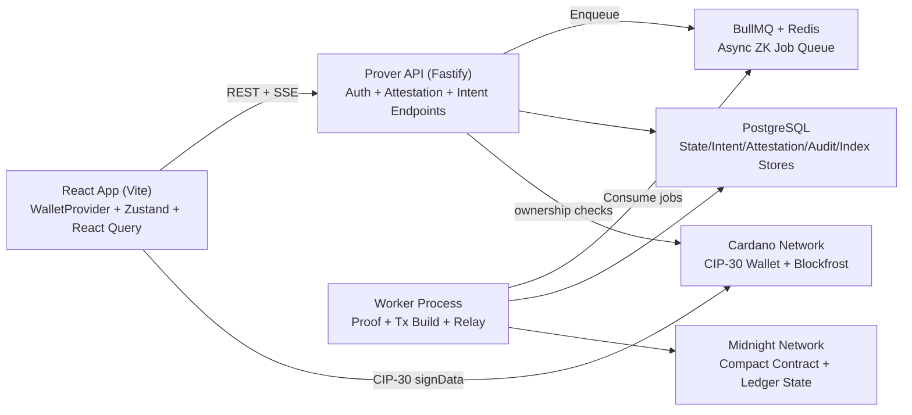

# DarkWallet

DarkWallet is a privacy-preserving prescription authorization and pickup application for the Midnight + Cardano ecosystem.  
It combines:
- Midnight Compact ZK circuits (`pickup.compact`)
- Cardano asset attestations (CIP-30 signatures + Blockfrost ownership checks)
- Relayer-safe intent signing + queue-based execution
- A route-based React app with wallet self-custody

## Architecture



## Monorepo Layout

- `midnight/contract`: Compact contract source, managed artifacts, simulator tests
- `services/prover`: Fastify API, BullMQ worker, attestation/intent services, persistent stores
- `src`: Route-based frontend (`/`, `/attestation`, `/prescriptions`, `/history`, `/wallet`, `/dev`)
- `e2e`: Playwright suites (happy path + adversarial + accessibility + resilience)
- `docs`: API and security references

## Quick Start (Standalone)

1. Install dependencies:

```bash
npm install
```

2. Start local infrastructure:

```bash
docker compose -f services/prover/standalone.yml up -d
```

3. Configure env (minimum for local):

```bash
cp services/prover/.env.example services/prover/.env
```

4. Start full app (contract build + prover + web):

```bash
npm run dev:demo
```

5. Open:
- Web UI: `http://127.0.0.1:3000`
- API: `http://127.0.0.1:4000`

## Production Deployment

Use the production stack:

```bash
cp .env.example .env
```

```bash
docker compose -f docker-compose.production.yml up --build
```

Included services:
- `prover` (Fastify API + worker runtime image)
- `redis` (BullMQ backend)
- `postgres` (persistent stores)
- `nginx` (TLS/static/web reverse proxy)

## Configuration Model

DarkWallet accepts legacy `MIDLIGHT_*` env vars and modern `DARKWALLET_*` aliases (legacy keys log deprecation warnings). The v2 target is to make `DARKWALLET_*` primary while keeping documented migration guidance.

Core required values outside standalone:
- `MIDNIGHT_NETWORK=preview|preprod|mainnet`
- `MIDNIGHT_WALLET_SEED`
- `MIDLIGHT_API_SECRET` or `DARKWALLET_API_SECRET`
- `MIDLIGHT_ENCRYPTION_KEY` or `DARKWALLET_ENCRYPTION_KEY`
- `MIDLIGHT_ORACLE_PRIVATE_KEY` or `DARKWALLET_ORACLE_PRIVATE_KEY`

Mainnet additionally requires:
- `MIDLIGHT_DATABASE_URL` or `DARKWALLET_DATABASE_URL`
- `BLOCKFROST_PROJECT_ID`

See:
- `services/prover/.env.example`
- `docs/SECURITY.md`

## Frontend Routes

- `/`: dashboard
- `/attestation`: challenge/sign/verify Cardano asset attestation wizard
- `/prescriptions`: register/redeem/check flow with job pipeline tracking
- `/history`: indexed pickup ledger table
- `/wallet`: wallet details and connection controls
- `/dev`: developer/admin operations (clinic init, deploy/join, state read)

## API Surface

Core endpoints:
- `GET /api/health`
- `POST /api/v1/attestations/challenge`
- `POST /api/v1/attestations/verify`
- `GET /api/v1/attestations/:attestationHash`
- `POST /api/v1/intents/prepare`
- `POST /api/v1/intents/submit`
- `GET /api/jobs/:jobId`
- `GET /api/jobs/:jobId/events` (SSE)
- `GET /api/v1/pickups`

Full reference: `docs/API.md`.

## Security Model Highlights

- Browser wallet self-custody (backend never receives private keys)
- Signed intent submission with nonce replay protection
- Oracle-signed attestation envelope binding L1 ownership proofs
- API bearer auth with SSE token support
- Secret encryption at rest (`AES-256-GCM`) in file and PostgreSQL stores
- Nullifier replay prevention in Compact contract

See: `docs/SECURITY.md`.

## Quality Gates

Run all local checks:

```bash
npm run lint
npm run typecheck
npm test
npm run test:sim
npm run test:e2e
npm run build
```

## Current Status

- TypeScript frontend with route-based UX
- BullMQ + Redis asynchronous proving/relay pipeline
- Cardano attestation verification path with challenge lifecycle
- Relayer intent prepare/submit flow with replay protection
- 12-scenario Playwright matrix including adversarial and resilience paths
