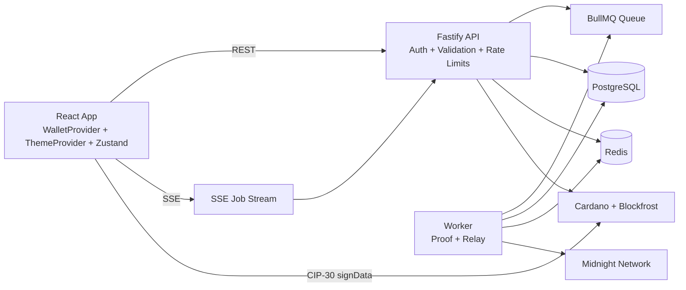
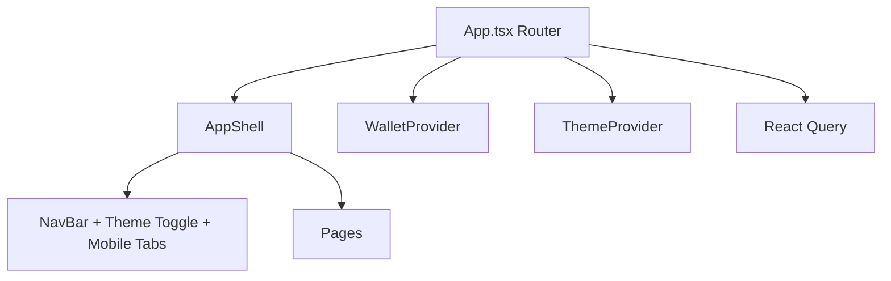
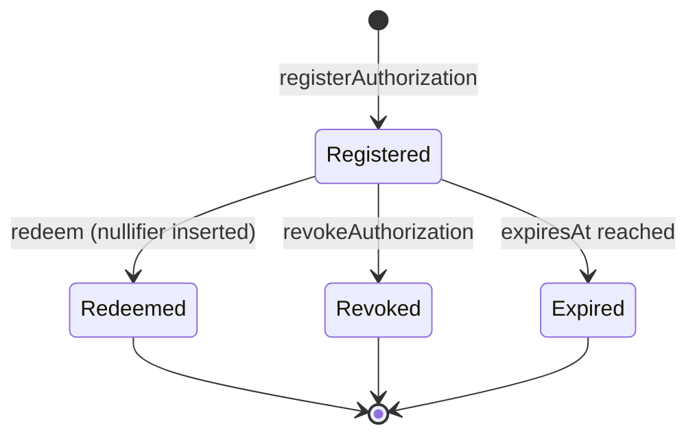

# DarkWallet Architecture

## System Data Flow

## Frontend Composition

## Contract State Machine (`pickup.compact`)

## Core Security Invariants

- No plaintext secrets on ledger state.
- Nullifier prevents redeem replay.
- Attestation hash binds Cardano ownership verification into intent flow.
- Intent nonce uniqueness prevents signature replay.
- API request auth + per-endpoint rate limiting protects relay resources.
